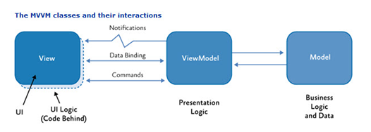

#### PREPARE

> 现阶段前端三大主流框架`react`,` vue`, `angular`都属于 MVVM范畴，即 模型---视图---视图模型
>
> 
>
>  采用数据驱动， 即监听数据改变，渲染view。
>
>  核心是监听数据的变更！
>
>  其中`React`使用的是 `diff`  算法来实现数据变更检测的；
>
>  `Angular` 则使用的是`zone.js`实现数据变更检测；
>
>  `Vue`则使用`Object.defineProperty`, 后期版本则使用`Object.Proxy`
>
>  本文参考`Vue` 使用 `Object.defineProperty`实现数据变更检测， 实现一个简单的 `mvvm`框架

#### INIT

##### 1.下面是一个简单的类`Vue`组件的实现方式

* html

  ``` html
  <div id="app">
      <h1>{{song}}</h1>
      <p>{{singer.a.b}}</p>
      <p>{{age}}</p>
      <input type="text" v-model="age" />
  </div>
  ```

* javascript

   ``` javascript
    let mvvm = new Mvvm({
              el: '#app',
              data: {
                  song: 2,
                  singer: {
                      a: {
                          b: 1
                      },
                      c: 1
                  },
                  age: 55
              }
          })
   ```

*  首先是一个 `Mvvm`类，接受两个参数（后期会加入method等参数）: `el` 和`data`。  

#####  2. 定义`Mvvm`类

``` javascript
function Mvvm(options = {}) {
    
    /*定义类的$option属性，_data私有属性，并将 私有$option.data的引用复制给私有属性_data和局部变  量data
     */
    this.$options = options;
    let data = this._data = this.$options.data;
    
    /*将data中所有的key设置观察者，增加数据变更的检测*/
    observe(data);
    
    /*将data中的所有的key代理到Mvvm实例上，形成mvvm实例树，方便书写*/
    for (let key in data) {
        Object.defineProperty(this, key, {
            configurable: true,
            get() {
                return this._data[key];
            },
            set(newVal) {
                this._data[key] = newVal;
            }
        })
    }
    
    /*数据如果变更，执行dom渲染*/
    new Compile(this.$options.el, this)
}
```
##### 3.看一下 `observe` 方法：

``` javascript
function observe(data) {
    if (!data || typeof data !== 'object') return;
    return new Observe(data);
}
```

增加了一个`data`类型检测机制(实际上为了递归结尾判断)，实际上执行 `Observe`类的实例化

#####4. `Observe`类

``` javascript
function Observe(data) {
    
    /*创建一个消息订阅发布池类，包含一个watcher属性，watcher指向一个Watcher的实例，每个Watcher实例  都是一个订阅者，另一个属性是一个事件池数组events*/    
    let dep = new Dep();
    
    /*data的每一个键值对循环执行observe方法*/
    for (let key in data) {
        let val = data[key]
        observe(val);
        
        /*对data的每一个key进行数据拦截, 设置get，当创建一个Watcher实例的时候，显示触发get，此时将这个Watcher实例（订阅者）添加到消息订阅发布池的事件池中；设置set 当设置新的值时候，触发 set方法， 如果所设值与原来不相等， 则重新监听新的值得变更， 并触发Watcher实例（订阅者）的notify方法，触发 Watcher实例的回调，更新视图数据*/
        Object.defineProperty(data, key, {
            configurable: true,
            get() {
                Dep.watcher && dep.addEvent(Dep.watcher);
                return val;
            },
            set(newVal) {
                if (val === newVal) {
                    return;
                }
                val = newVal;
                observe(newVal);
                dep.notify();
            }
        })
    }
}
```

##### 5.消息订阅发布池`Dep`

* 类：

  ``` javascript
  function Dep() {
      this.watcher = null;
      this.events = [];
  }
  ```

* 实例：

  ```javascript
  Dep.prototype = {
      addEvent(event) {
          this.events.push(event);
      },
  
      notify() {
          this.events.forEach(event => event.update())
      }
  }
  ```

#####6. 订阅者`Watcher`

* 类

  ```javascript
  /*Watcher接收三个参数，第一个是整个mvvm实例树对象， 第二个是html中的插值表达式{{song.a.b}}, fn为设置新值之后的会调*/
  function Watcher(vm, exp, fn) {
      this.fn = fn;
      this.vm = vm;
      this.exp = exp;
      // 将watcher的实例赋值给Dep的watcher属性，方便调用，而不用传参
      Dep.watcher = this;
      
      // 进行一次取值操作， 显示触发mvvm实例树某个key的get方法，从而将 Dep.watcher 添加到事件池中
      // 将如song.a.b以点号分割成数组arr，将mvvm实例树的引用赋值给局部变量val
      let arr = exp.split('.');
      let val = vm;
      // 循环arr 取song.a.b的值
      arr.forEach(key => {
          val = val[key]
      });
      // 添加完之后，释放 Dep.watcher
      Dep.watcher  = null;
  }
  ```

* 实例

  ```javascript
  
  /*Watcher实例的update方法会从mvvm实例树上取出exp所对应的值，并触发fn回调，渲染视图*/
  Watcher.prototype.update = function () {
      let arr = this.exp.split('.');
      let val = this.vm;
      arr.forEach(key => {
          val = val[key]
      });
      this.fn(val);
  }
  ```

##### 7.Compile类

Compile类用于将所选的`el`元素节点 赋值给`mvvm`实例树，并转为`createDocumentFragment`  文档片段， 之后所需要替换的文本节点进行正则匹配并替换，之后将新的文档片段统一添加到`el`元素节点中。

关于文档碎片可以 [在这里](https://developer.mozilla.org/en-US/docs/Web/API/Document/createDocumentFragment) 了解

``` javascript
function Compile(el, vm) {
    /*获取元素节点*/
    vm.$el = document.querySelector(el);
    
    /*创建文档碎片对象*/
    let fragment = document.createDocumentFragment();
    
    /*当vm.$el.firstChild存在时，将vm.$el.firstChild依次加入到文档碎片中*/
    while (child = vm.$el.firstChild) {
        fragment.appendChild(child);
    }
    
    /*对html文档中的插值表达式等进行替换*/
    function replace(frag) {
        
       
        Array.from(frag.childNodes).forEach(node => {
            
            // 插值表达式
            let txt = node.textContent;
            let reg = /\{\{(.*?)\}\}/g；
            if (node.nodeType === 1 && reg.test(txt)) {
                let arr = RegExp.$1.split('.');
                let val = vm;
                arr.forEach(key => {
                    val = val[key]
                });
                // 执行替换
                node.textContent = txt.replace(reg, val).trim();
                
                // 添加监听
                new Watcher(vm, RegExp.$1, (newVal) => {
                    node.textContent = txt.replace(reg, newVal).trim();
                })
            }
            
            // 双向数据绑定
            if(node.nodeType ===1 ) {
                let nodeAttr = node.attributes;
                // console.log(nodeAttr)  Map

                Array.from(nodeAttr).forEach(attr => {
                    let name = attr.name;
                    let value = attr.value;

                    if (name.includes('v-')) {
                        
                        let arr = value.split('.');
                        let val = vm;
                        arr.forEach( key => {
                            val = val[key]
                        })
                        console.log(value)
                        node.value = val
                    }

                    new Watcher(vm, value, (newVal) => {
                        node.value = newVal;
                    });

                    node.addEventListener('input', e => {
                        // 根据传入的绑定值的对象深度值来处理， 如果是单个值，则直接赋值， 如果是多个，则使用eval()函数处理
                        if(value.split('.').length > 1) {  
                            eval("vm."+ value + "= e.target.value");
                        } else {
                            vm[value] = e.target.value
                        }                        
                    })
                })
            }

            if (node.childNodes && node.childNodes.length) {
                replace(node)
            }
        })
    }

    replace(fragment);
    vm.$el.appendChild(fragment);
}
```


#### LAODED

> 以上是一个简单的mvvm框架的实现，当然defineProperty还是有一些问题，比如说对应数组的变更检测是办不到，而Proxy的出现则解决了这类问题，有时间的话，大家可以试试基于Proxy去实现一套简单的mvvm框架。